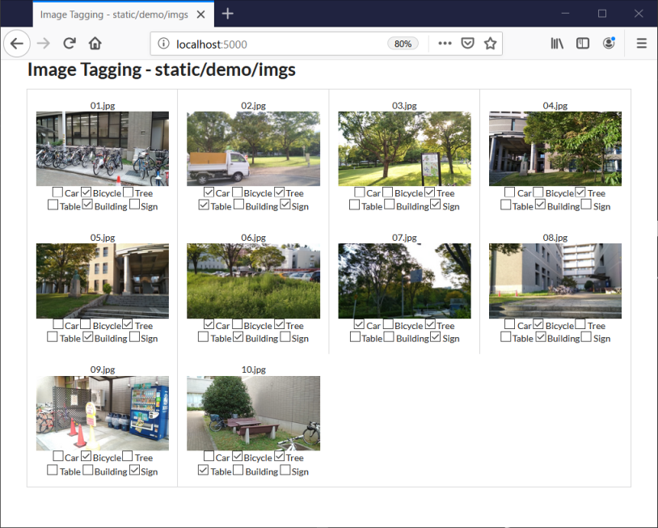

# Image Tagging Application #

## Prepare ##
1. Install packages

    pip install flask waitress toml

2. Put image files in `static/imgs`
3. Edit config file `settings.toml`

## Run ##
    python app.py
Open localhost:5000 in a web browser.

## Demo ##
    python app.py --settings static/demo/settings.toml